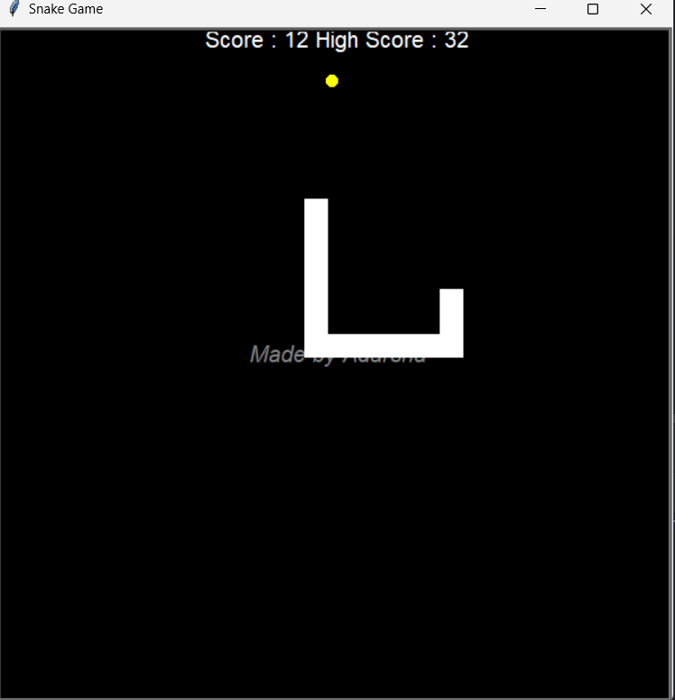
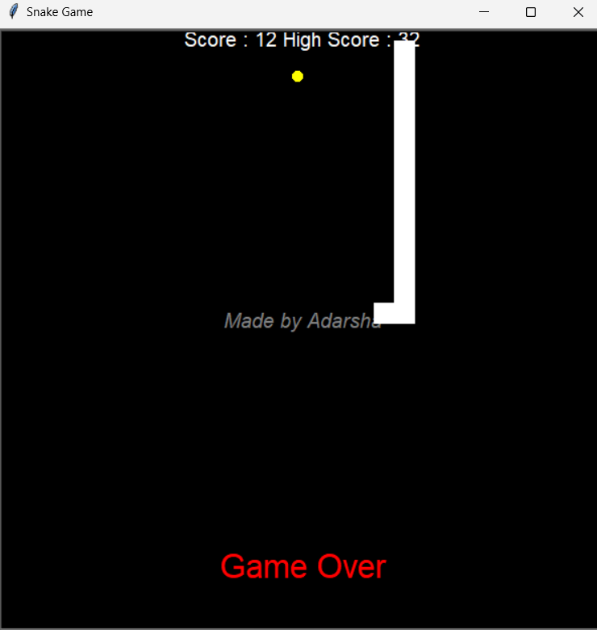

# Snake Game

This is a simple Snake Game built using Python's Turtle graphics library. The game is designed to be a fun and interactive experience where the player controls a snake to eat food, grow in size, and avoid collisions.

## Table of Contents

- [Installation](#installation)
- [Usage](#usage)
- [Modules](#modules)
  - [main.py](#mainpy)
  - [snake.py](#snakepy)
  - [food.py](#foodpy)
  - [scoreboard.py](#scoreboardpy)
  - [watermark.py](#watermarkpy)
- [Game Mechanics](#game-mechanics)
- [How to Play](#how-to-play)
- [Contributing](#contributing)
- [License](#license)

## Installation

1. Clone the repository:

   ```bash
   git clone https://github.com/AdarshaRimal/Snake-Game-GUI.git


2. Navigate to the project directory:

    ```bash
    cd snake-game
    ```

3. Ensure you have Python installed on your system. The game requires Python 3.x.

4. Run the game:

    ```bash
    python main.py
    ```

## Usage

- Use the arrow keys on your keyboard to control the snake's direction.
- The objective is to eat the food that appears on the screen.
- Every time the snake eats food, it grows longer.
- Avoid colliding with the walls or the snake's own body.

## Modules

### main.py

The main entry point of the game, responsible for setting up the screen, initializing the game objects, and managing the game loop.

### snake.py

This module contains the `Snake` class, which manages the creation and movement of the snake.

- `create_snake()`: Initializes the snake.
- `move()`: Controls the movement of the snake.
- `extend_snake()`: Extends the snake when food is eaten.
- Directional control methods: `up()`, `down()`, `left()`, `right()`.

### food.py

This module contains the `Food` class, which generates food at random positions on the screen for the snake to eat.

- `refresh()`: Generates a new random position for the food.

### scoreboard.py

This module contains the `Score` class, which manages the game's score and high score.

- `update()`: Updates the score display.
- `game_over()`: Displays the "Game Over" message.
- `reset()`: Resets the score when the game restarts.

### watermark.py

This module contains the `Watermark` class, which adds a watermark to the game screen.

- Displays "Made by Adarsha" at the center of the screen.

## Game Mechanics

- The snake moves continuously in the direction it is facing.
- The game ends when the snake collides with the wall or its own body.
- The score increases by 1 every time the snake eats food.
- The highest score is stored in a file named `data.txt` and is displayed during the game.

## How to Play

1. Run the game using Python.
2. Use the arrow keys to navigate the snake.
3. Eat the yellow food that appears on the screen.
4. Avoid colliding with the walls or your own tail.
5. Try to beat your high score!
## Screenshots



## Contributing

Contributions are welcome! If you have suggestions or improvements, feel free to create a pull request or open an issue.

## License

This project is licensed under the MIT License. See the [LICENSE](LICENSE) file for details.
